# Wireframes

## mainMap
This is the main page of the application. Users can set time period and tap on map to review relavent art and music piece. Users can also set time period and search location on search bar to accomplish the same purpose.
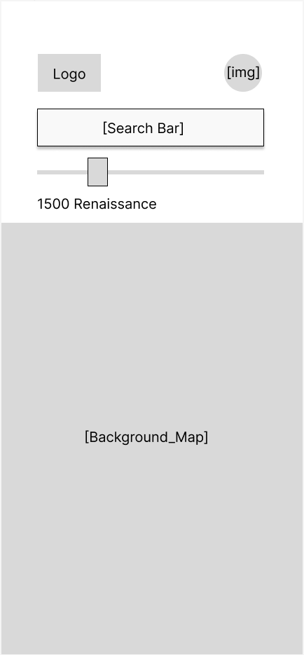

## search
App will display keyboard when user taps on search bar. A relavent location will be marked on the map. User can tap on map to return to previous page, or click "search" in keyboard to review further information.
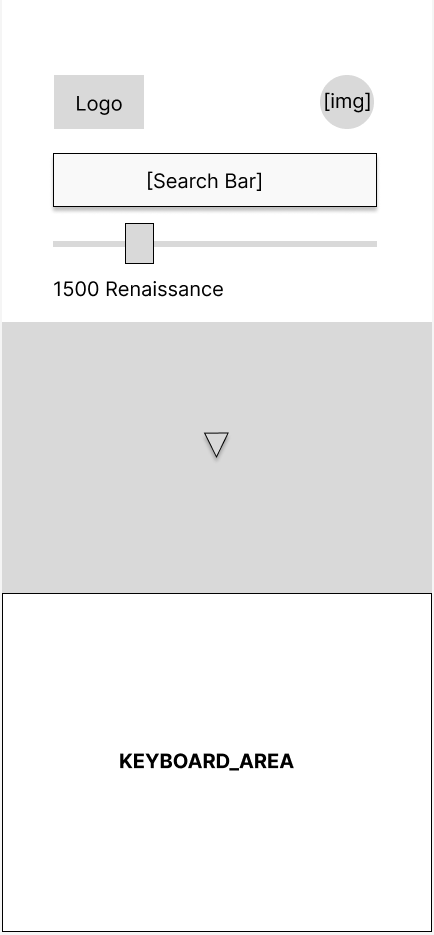

## informationPop
After user targets a specific location, either by searching or by tapping on map, two random pieces of cultural work will be recommended to user. One is art, and the other is music. User can tap on either to read further informaation. Or user tap on mapa to the previous page.
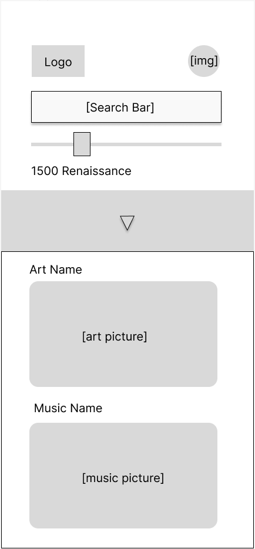

## informationDetail
In thie page, user can read specific information about an artwork or a music. User can access this page by search or by "favorate file" in their user account. User can like or dislike an artwork.
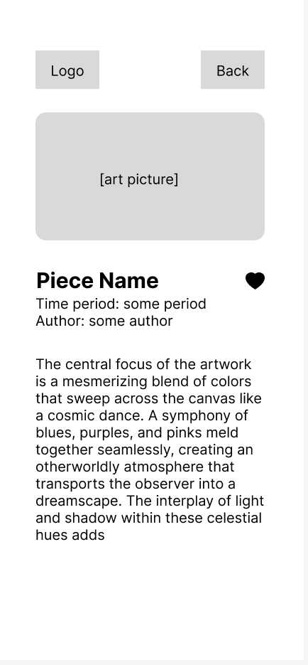

## account
This page is the portal for users to view and edit personal information. User can click to access all the art and music the liked. User can also further to the page to edit profile
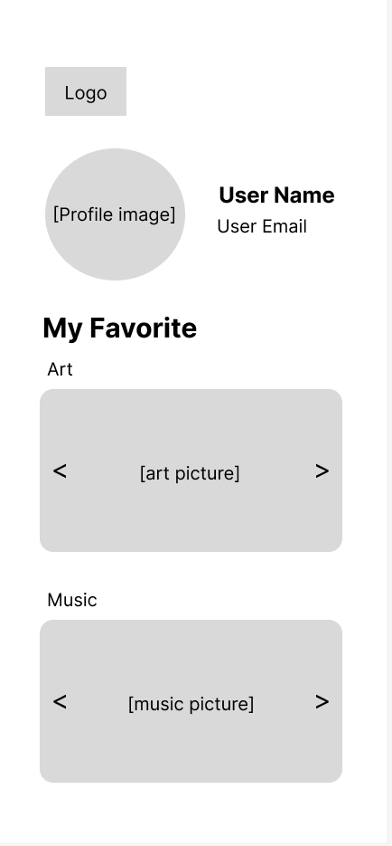
User can slide left or right on the pictures their favorite piece to view the previous or the next one.
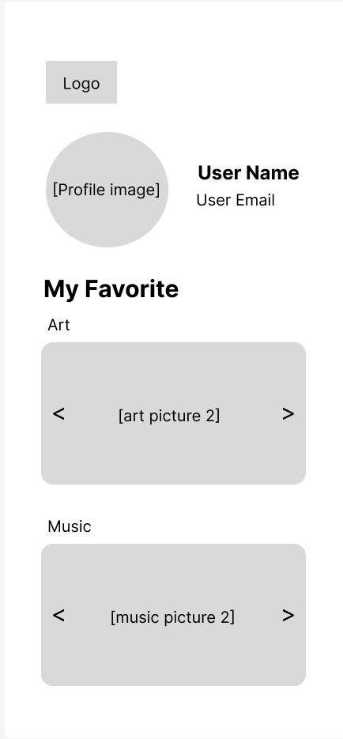

## accountEdit
User can access various pop ups to edit their account information.
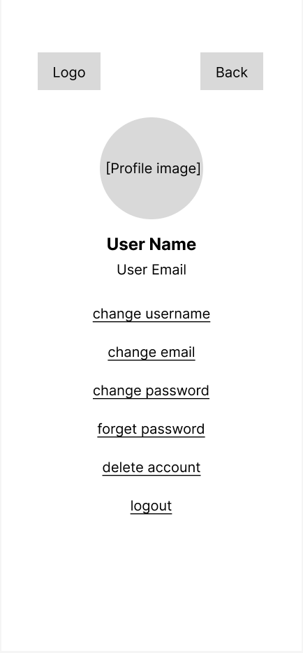

### editUsername
User can change username in this popup.
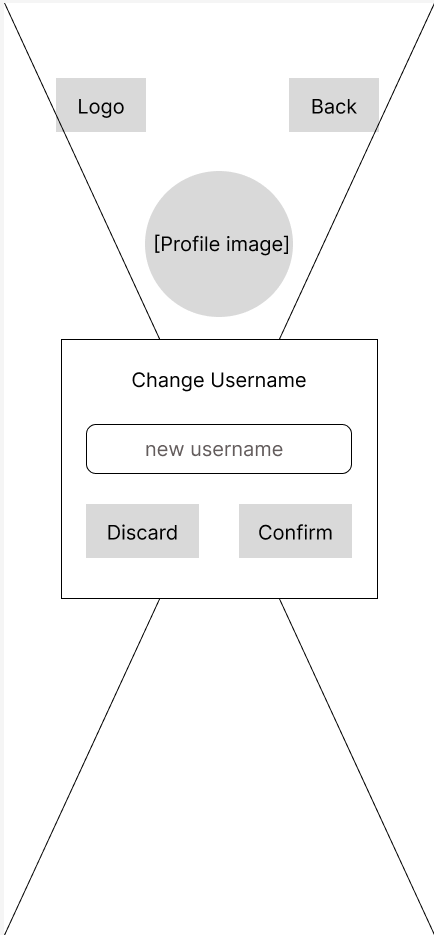

## editEmail
User can edit email in this popup

### editPassword
User can change password in this popup
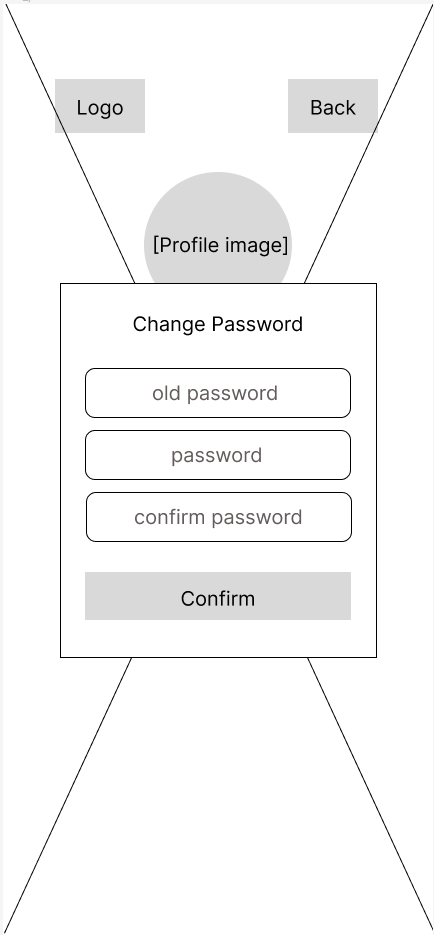

### editForgetPassword
User can edit forgotten password this popup
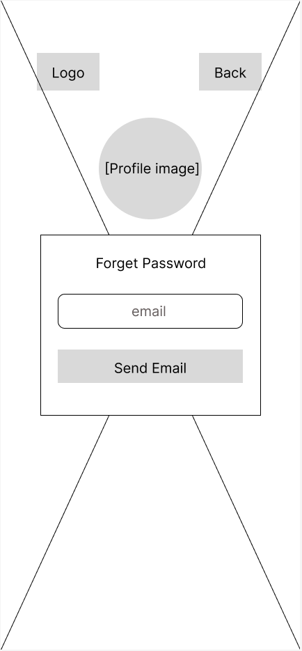

## editDelete
User can delete the whole account this page

## login
User can log into their account. User can also visit the app as a guest. New user can register. And returning user can find back their password.
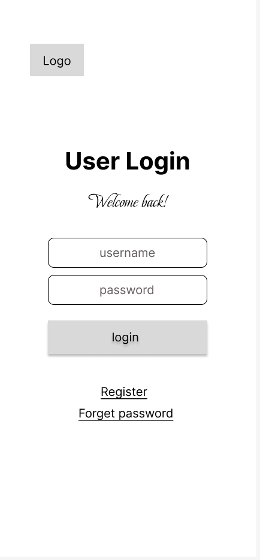

## loginForgetPassword
A retunning user is able to find their password by following email instruction.
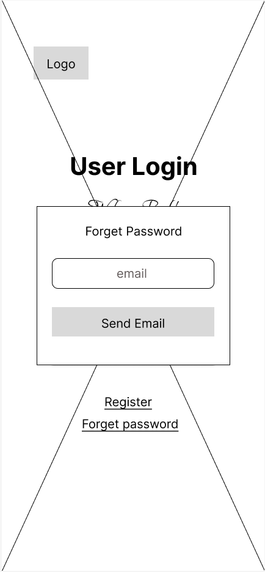

## loginIncorrectUser
After entering a wrong combination of username and password, a notification will appear to remind the user.
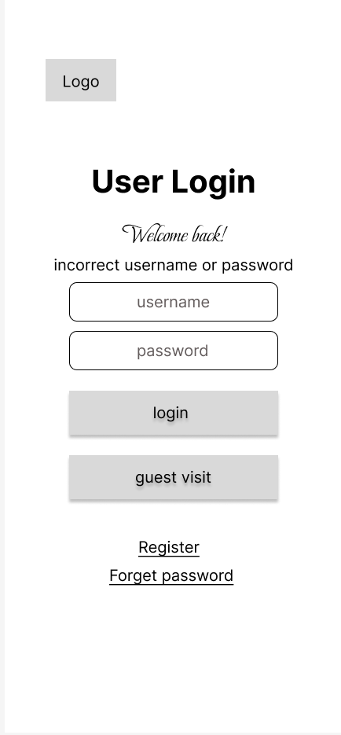

## register
New user can register for a new account.
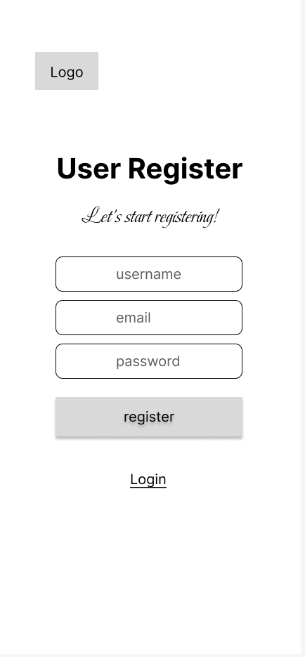